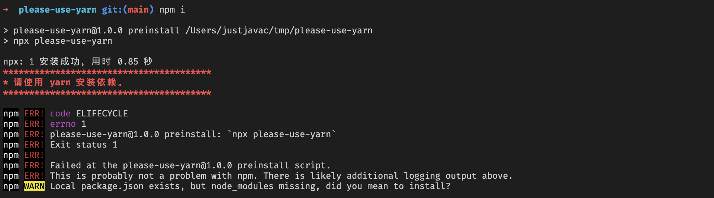

# please-use-yarn

> 强制在项目中使用 yarn 作为包管理器

## 使用

在 `package.json` 文件的 scripts 中添加 `preinstall`：

```json
{
  "scripts": {
    "preinstall": "npx please-use-yarn"
  }
}
```

## 效果

当使用 `npm i` 安装依赖时，会报错并停止安装。



**备注**: 如果不想看到 `npx: 1 安装成功，用时 xxxx 秒`，可以使用 `--quiet` 选项(或者 `-q`):

```json
{
  "scripts": {
    "preinstall": "npx -q please-use-yarn"
  }
}
```

## License

[MIT](LICENSE)
